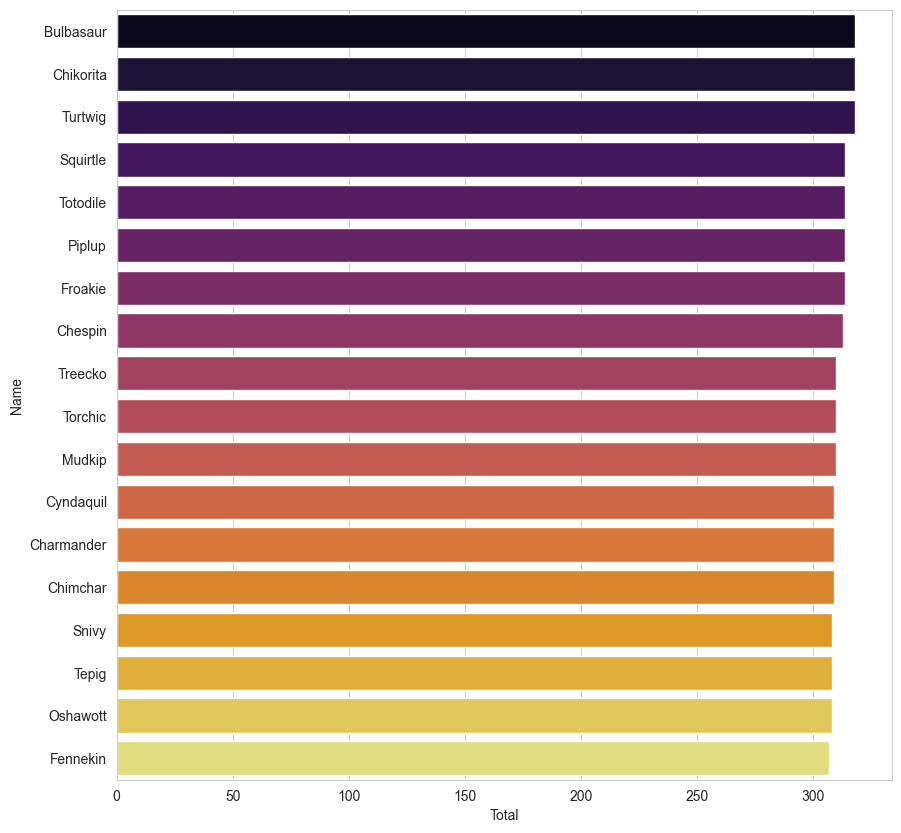
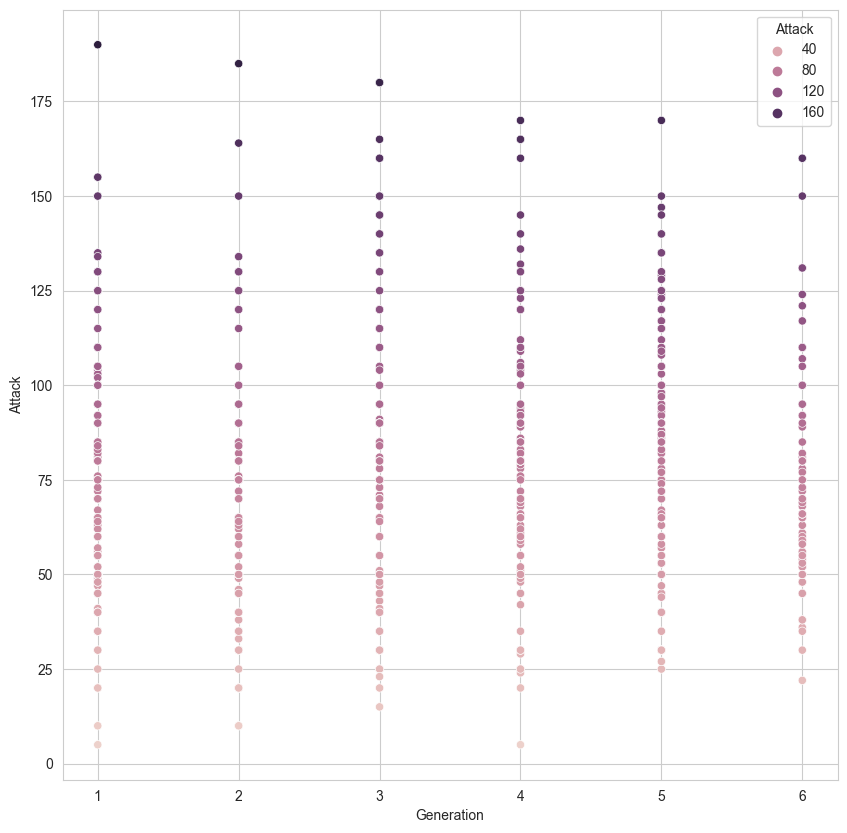

# Pokemon Data Analysis

A simple analysis of a Kaggle data set including Pokemon from generation 1 to generation 6 based on the Pokemon games (not Pokemon cards or Pokemon Go).

Answers questions such as: 
* "What is the best starter Pokemon?"
* "What is the strongest Pokemon after excluding mega and legendary?"
* "Is speed and attack positively correlated?"

Utilizes pandas, matplotlib, and seaborn to create visual representations of the data.

# Data Preview

**Best Starter Pokemon**

To answer the question of "What is the best starter Pokemon?," the total stats of each 18 starter Pokemon was used to compare. 
Total includes HP, attack, defense, speed, special attack, and special defense. Comparing the starter Pokemon in this way resulted in a tie for 
what can be considered the best starter Pokemon. Bulbasaur, Chikorita, and Turtwig tied as the best starter.  
 

---
 

**Attack Levels over 6 Generations**

To answer the question of "Do Pokemon become stronger in later generations?," the attack of each Pokemon from every generation was graphed. 
The average attack per generation is as follows: 
* Generation 1: Attack 76.638554
* Generation 2: Attack 72.028302
* Generation 3: Attack 81.62500
* Generation 4: Attack 82.867769
* Generation 5: Attack 82.066667
* Generation 6: Attack 75.804878
